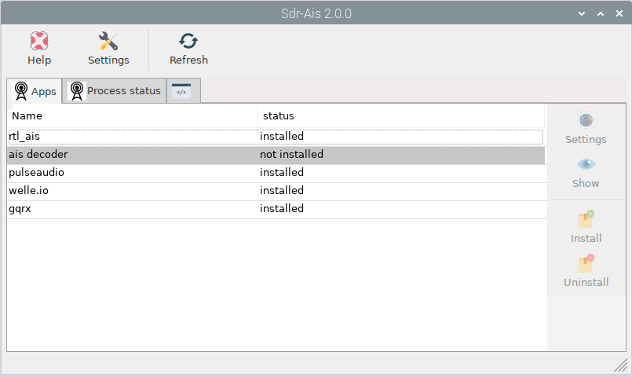
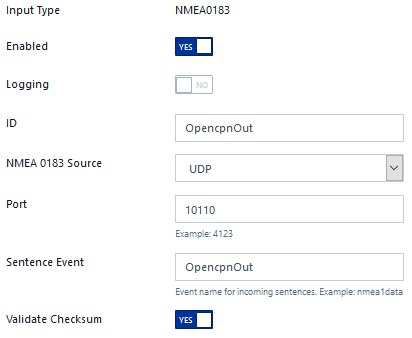
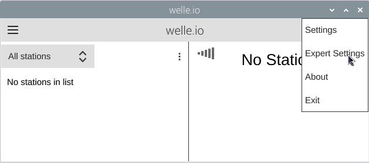
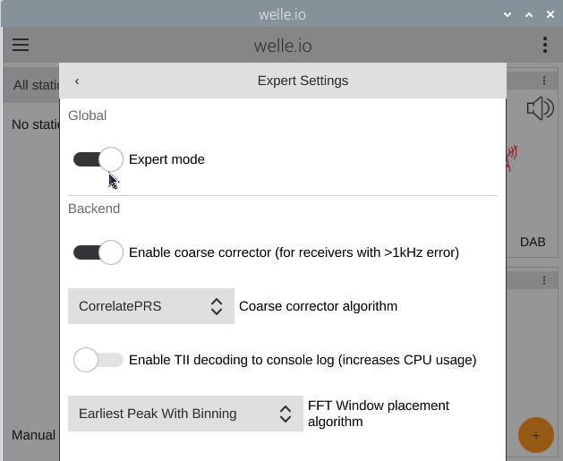
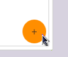
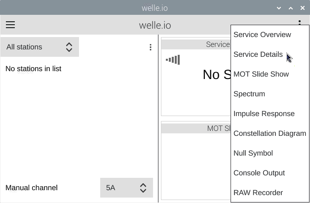
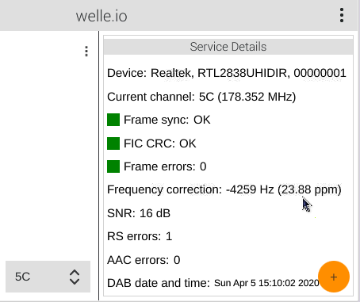
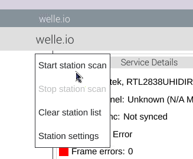

Sdr-ais
#######

Picture: Sdr-ais app

Features
********

* Installer / Setup
* Ais decoder sdr -> nmea 0183 stream to UDP 10110
* Analog radio
* Digital radio

.. Note::
	A simultaneous access to the sdr dongle is not possible. Make sure that only one program has access to it.

Ais decoder
***********

You can choose between two ais decoder. 
It is very important to set the ppm of your rtl-sdr. (See welle.io to get the ppm of your device)
The autostart process can be enabled and the process can be started, stopped and restarted.

Signal K settings should be added as shown in the picture.

Picture: Signal K communication is done on the same UDP port as OpencpnOut. 

Gqrx
****

It is a world band receiver software. The marine vhf channels can be found in the bookmarks. 

.. Warning::
	FM stereo generates high processor load, which can also affect Signal K. Processor heat and power consumption rise.

Installation:

* Gqrx does need pulseaudio. Install pulseaudio from the Apps page and reboot the system.

Welle.io
********

Is a DAB, DAB+ receiver software.
To see ppm and additional information, you should enable Expert Settings

Picture: The ppm of your dongle show up if you receive a DAB station.

A station scan can be started (this will take more than 3 minutes)

Installation:

* Welle.io does need pulseaudio. Install pulseaudio from the Apps page and reboot the system.

